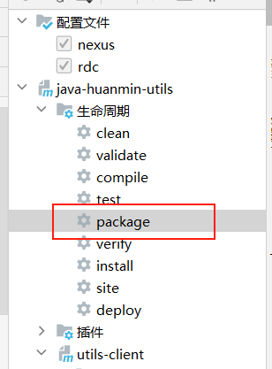

# lixiang-utils  理想项目工具库

## 技术架构

前端使用技术vue3+vuex4+router4+zui3

- https://easysoft.github.io/zui/3/
- https://cn.vuejs.org/guide/quick-start.html
- https://router.vuejs.org/zh/installation.html
- https://vuex.vuejs.org/zh/guide/

后端使用技术: springboot2.5+mybatis-plus3.4+mysql8.0, redis,es,mq.....
- https://baomidou.com/pages/24112f/
- https://springdoc.cn/spring-boot/    ###   https://spring.io/projects/spring-boot/
- https://mysqljiaocheng.com/index.html 
- https://redis.com.cn/tutorial.html
- https://zhuanlan.zhihu.com/p/451571598

## 项目结构说明
[utils-client](utils-client) : 对外提供rpc接口,此模块没有任何逻辑代码，只是一个接口的定义，方便其他模块引用

[utils-common](utils-common) :  对外提供的公共工具类 

[utils-server](utils-server) :  对外提供的服务端实现

## 启动说明
必须先打包所有的模块，然后再启动服务端

然后在启动[utils-server](utils-server)模块的Application类,否则会导致有些自动加载的类没有加载到，导致启动失败
